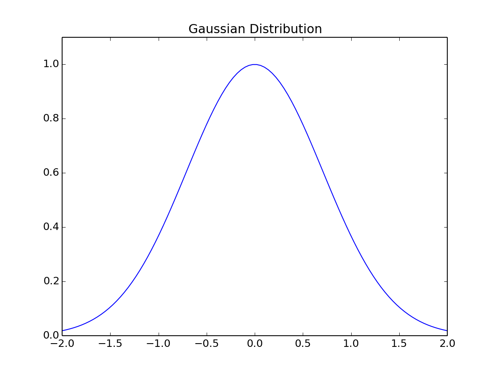

# Introduction

This is a brief example of what this collection of scripts does. The metadata above is used to generate the title page of the report.

[fig:labels-are-required]

| a | b | c | d |
|:--|:-:|:-:|--:|
| 1 | 2 | 3 | 4 |
: This is an example table.
[table:labels-are-required-too]

Figure and table labels are required and must appear in [square brackets] below the object they are labeling.

\begin{equation}
E = m c^2
\label{eq:optional}
\end{equation}

Equations have to be entered in standard LaTeX format. As do \emph{italicized} and \textbf{bolded} passages. I'll work on that in the future.

Careful of typos! The makefile will hang if it encounters a LaTeX error while converting to PDF.